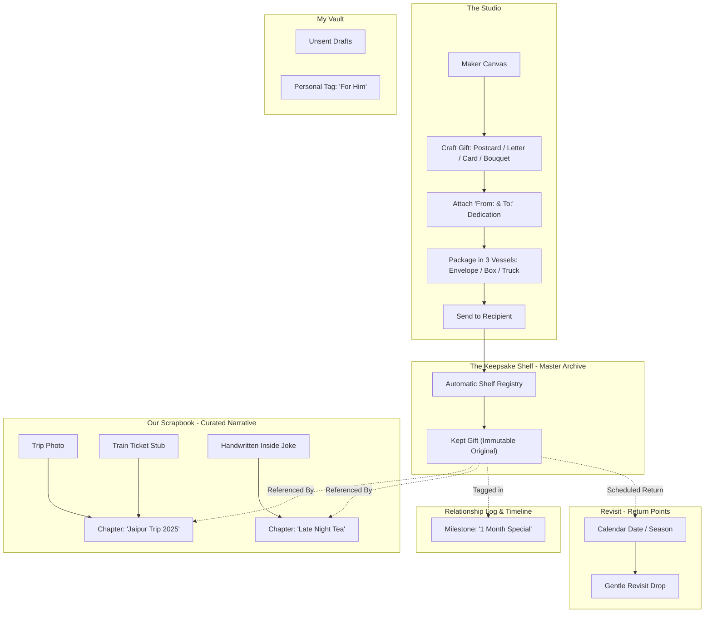

# Information Architecture & Taxonomy Specification (`IA_SPEC.md`)
*Phase 3: Object Modeling, Master Archive vs. Narrative Scrapbook, and Navigation Schema*

---

## 1. Architectural Foundation & Mental Model

### The Core IA Axioms
- **The Keepsake Shelf (Master Archive):** The permanent, automated repository of all exchanged gifts (letters, postcards, greeting cards, bouquets). Nothing given or received is ever lost. Non-gift ephemera (raw photos, ticket stubs) *never* clutter the shelf.
- **The Scrapbook (Narrative Curation):** User-authored story chapters (e.g., *"Jaipur Trip 2025"*, *"Late Night Tea"*). Chapters hold multi-media ephemera and **point/reference** gifts on the shelf without duplicating them.
- **The Relationship Log (Milestone Ledger):** A chronological spine linking special occasions (e.g., *"1 Month Special"*, *"First Apartment"*) to specific gifts or scrapbook moments.
- **My Vault (Personal Sanctuary):** Private drafts, personal reflections, unshared received items, and private tags (e.g., *"For Him"*, *"Gift Ideas"*).
- **The Universal "From: & To:" Gesture:** A cute, intimate handwritten dedication label (*"From: [Name] / To: [Name]"*) stamped or tucked onto every gift, parcel, envelope, ribbon, and keepsake—reinforcing the tactile essence of *"A little something, from me to you"*.

---

## 2. Object-Oriented UX (OOUX) Anatomy

```
┌────────────────────────────────────────────────────────────────────────────────────────┐
│                                OOUX OBJECT TAXONOMY                                    │
├────────────────────┬────────────────────┬────────────────────┬─────────────────────────┤
│  1. THE POSTCARD   │   2. THE LETTER    │  3. GREETING CARD  │     4. THE BOUQUET      │
│  • Front Artwork   │  • Contemporary    │  • Tactile Bi-fold │  • Bespoke: Stem picker │
│  • 3D Flip Action  │    Stationery Tint │  • Cover Artwork   │  • Readymade: Sets      │
│  • Back Message    │  • Typography Scale│  • Interior Spread │  • Wrapping Paper Craft │
│  • Postal Stamps   │  • Ink Nuances     │  • Tuck-in Polaroid│  • Ribbon Material      │
│  • "From & To" Tag │  • Sticker Ephemera│  • "From & To" Seal│  • Florist Tag Dedication│
└────────────────────┴────────────────────┴────────────────────┴─────────────────────────┘
```

### Detailed Object Specifications

#### A. Digital Postcard
- **Visual Presentation:** Heavy tactile cardstock with subtle edge-wear.
- **Interaction:** Tap/swipe horizontally to perform a realistic 3D card flip.
- **Front Face:** High-resolution photo, custom illustration, or studio art.
- **Back Face:** Divided layout—left side for handwritten note; right side for address block, collectible postal date stamps, and a handwritten *"From: [Name] / To: [Name]"* mark.

#### B. Contemporary Letter
- **Aesthetic Tone:** Warm, modern tactile simplicity (avoiding exaggerated faux-parchment clichés).
- **Typography Engine:** Curated pairing of modern serif and expressive handwriting scripts; adjustable letter-spacing, line height, and ink opacity.
- **Paper Canvas:** Pure white and warm cream stationery washes (pure cotton, cloud dancer, linen cream).
- **Ephemera Layer:** Placement of contemporary stickers, pressed botanical stamps, and margin notes.
- **Dedication:** Elegant top or footer sign-off: *"From: [Name] / To: [Name]"*.

#### C. Greeting Card
- **Visual Presentation:** Premium bi-fold card with realistic paper crease physics.
- **Interaction:** Gentle opening fold animation (lifts open like a real card, with instant-skip option).
- **Exterior Cover:** Curated festive, sentimental, or whimsical cover art; customizable cover title.
- **Interior Spread:** 
  - Left page: Optional tuck-in photo pocket (for a polaroid or keepsake snapshot).
  - Right page: Handwritten personal message spread (Black, Dark Brown, Dark Blue ink).
  - Dedication: Embossed or handwritten *"From: [Name] / To: [Name]"* closure.

#### D. Botanical Bouquet
- **Mode 1: Bespoke Atelier (Stem-by-Stem):**
  - Stem selection from a rich botanical index (Dahlia, Tulip, Gardenia, Peony, Lily, Orchid, Rose, Sunflower, Lilac, Baby's Breath, Hydrangea, Snapdragon, Japanese Anemones, Persian Buttercup, Foxglove).
  - Arrangement canvas allowing custom flower placement, rotation, and layering.
  - Wrapping paper selection (kraft paper, frosted wax paper, pleated linen, vintage newsprint).
  - Ribbon choice (raw silk, grosgrain, velvet, twisted jute twine).
  - Florist gift tag tied to the ribbon bearing the personal dedication: *"From: [Name] / To: [Name]"*.
- **Mode 2: Readymade Bouquets:**
  - Pre-arranged bouquets for effortless, spontaneous gestures when the sender wants to offer immediate comfort or celebration.

---

## 3. Structural Relationship Diagram



---

## 4. Top-Level Sitemap & Navigation Architecture

```
                                [ APP ENTRY ]
                                      │
        ┌───────────────┬─────────────┴─────────────┬─────────────────┐
        ▼               ▼                           ▼                 ▼
   [ STUDIO ]     [ KEEPSAKES ]               [ MY VAULT ]       [ REVISIT ]
  • Letter Desk  • Shelf (Master Gifts)      • Unsent Drafts     • Scheduled Drops
  • Postcard Lab • Scrapbook (Story Chapters)• Private Notes     • Memory Returns
  • Card Workshop• Relationship Milestone Log • Personal Tags    • Calendar Points
  • Florist Bench• Living Annotations Layer   • "For Them" Lists • Past Milestones
  • Wrapping Bar
```

### Navigation Rooms:
1. **Studio:** The crafting and wrapping atelier (Letters, Postcards, Greeting Cards, Bouquets, Delivery Vessels).
2. **Keepsakes:** The shared home (Master Keepsake Shelf + Curated Scrapbook Chapters + Relationship Milestone Log).
3. **My Vault:** The private personal haven (Unsent drafts, private notes, personal tags like *"For Him"*).
4. **Revisit:** The intentional return space (Time-scheduled memory drops, past milestone echoes, quiet future surprises).
