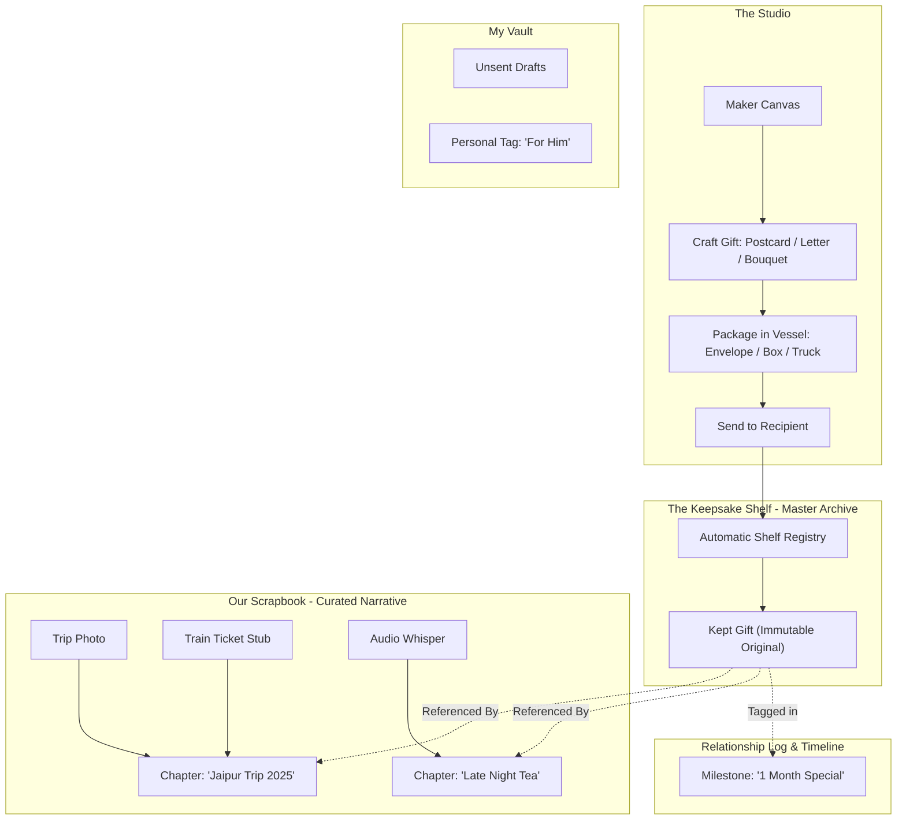

# Information Architecture & Taxonomy Specification (`IA_SPEC.md`)
*Phase 3: Object Modeling, Master Archive vs. Narrative Scrapbook, and Navigation Schema*

---

## 1. Architectural Foundation & Mental Model

### The Core IA Axiom
- **The Keepsake Shelf (Master Archive):** The permanent, automated repository of all exchanged gifts (letters, postcards, bouquets, cards). Nothing given or received is ever lost. Non-gift ephemera (raw photos, ticket stubs) *never* clutter the shelf.
- **The Scrapbook (Narrative Curation):** User-authored story chapters (e.g., *"Jaipur Trip 2025"*, *"Late Night Tea"*). Chapters hold multi-media ephemera and **point/reference** gifts on the shelf without duplicating them.
- **The Relationship Log (Milestone Ledger):** A chronological spine linking special occasions (e.g., *"1 Month Special"*, *"First Apartment"*) to specific gifts or scrapbook moments.
- **My Vault (Personal Sanctuary):** Private drafts, personal reflections, unshared received items, and private tags (e.g., *"For Him"*, *"Gift Ideas"*).

---

## 2. Object-Oriented UX (OOUX) Anatomy

```
┌────────────────────────────────────────────────────────────────────────┐
│                         OOUX OBJECT TAXONOMY                           │
├────────────────────┬────────────────────┬──────────────────────────────┤
│  1. THE POSTCARD   │   2. THE LETTER    │       3. THE BOUQUET         │
│  • Front Artwork   │  • Contemporary    │  • Bespoke: Stem catalog     │
│  • 3D Flip Action  │    Stationery Tint │  • Readymade: Curated sets   │
│  • Back Message    │  • Typography Scale│  • Wrapping Paper Texture    │
│  • Postal Stamps   │  • Ink Nuances     │  • Ribbon Material & Color   │
│    (Custom Dates)  │  • Sticker Ephemera│  • Attached Gift Tag Note    │
└────────────────────┴────────────────────┴──────────────────────────────┘
```

### Detailed Object Specifications

#### A. Digital Postcard
- **Visual Presentation:** Heavy tactile cardstock with subtle edge-wear.
- **Interaction:** Tap/swipe horizontally to perform a realistic 3D card flip.
- **Front Face:** High-resolution photo, original illustration, or studio art.
- **Back Face:** Divided format—left side for handwritten message; right side for address block, postal marks, and collectible date stamps.

#### B. Contemporary Letter
- **Aesthetic Tone:** Warm, modern tactile simplicity (avoiding exaggerated faux-parchment clichés).
- **Typography Engine:** Curated pairing of modern serif and expressive handwriting scripts; adjustable letter-spacing, line height, and ink opacity.
- **Paper Canvas:** Subtle pastel and earthy paper washes (linen white, sage, dusty oat, terracotta).
- **Ephemera Layer:** Placement of contemporary stickers, pressed botanical stamps, and margin notes.

#### C. Botanical Bouquet
- **Mode 1: Bespoke Atelier (Stem-by-Stem):**
  - Stem selection from a rich botanical index (e.g., wild cosmos, sweet pea, ranunculus, olive branch).
  - Arrangement canvas allowing custom flower placement, rotation, and layering.
  - Wrapping paper selection (kraft paper, frosted wax paper, pleated linen).
  - Ribbon choice (raw silk, grosgrain, twine knot).
  - Florist gift tag attached to the stem for a short personal dedication.
- **Mode 2: Readymade Bouquets:**
  - Pre-arranged bouquets for effortless, spontaneous gestures when the sender wants to offer immediate comfort or celebration.

---

## 3. Structural Relationship Diagram



---

## 4. Top-Level Sitemap & Navigation Architecture

```
                                [ APP ENTRY ]
                                      │
        ┌───────────────┬─────────────┴─────────────┬─────────────────┐
        ▼               ▼                           ▼                 ▼
   [ STUDIO ]     [ KEEPSAKES ]               [ MY VAULT ]       [ THE 4TH ROOM ]
  • Letter Desk  • Shelf (Master Gifts)      • Unsent Drafts     • Scheduled Drops
  • Postcard Lab • Scrapbook (Story Chapters)• Private Notes     • Memory Returns
  • Florist Bench• Relationship Milestone Log • Personal Tags    • Time Capsules
  • Wrapping Bar • Living Annotations Layer   • "For Them" Lists
```

### Proposed Names for the 4th Space (Resurfacing / Return Points):
1. **Echoes** (Poetic, sound of a memory returning across time).
2. **Revisit** (Clear, warm, active, and gentle).
3. **Return Points** (Precise and intentional, directly reflecting your concept brief).
4. **Seasons** (Cyclical, natural, patient).
