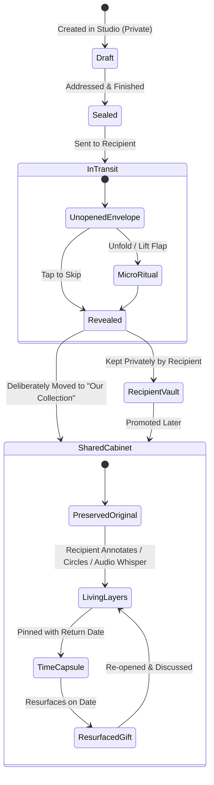

# A Little Something, From Me to You
*A Slow Digital Atelier for Sending, Keeping, and Rediscovering Affection*

---

## 1. Product Philosophy & Slow Design Axioms
Most communication tools treat messages as **disposable transactions** (sent, seen, scrolled past) or relationships as **data trackers** (streaks, checklists, anniversaries). 

*A Little Something* is framed as a **creative studio and intimate digital cedar chest**. It offers a quiet, tactile space where gifts are crafted with care, preserved deliberately, layered with collaborative responses, and resurfaced intentionally across time.

### Core Principles
1. **The Keepsake Continuum:** A gift becomes a keepsake, a keepsake becomes a shared memory, and a memory returns as a thoughtful surprise.
2. **Zero-Pressure & Asynchronous Serenity:** No streaks, no typing bubbles, no read receipts, and no artificial gamification. The app welcomes a one-time gesture just as warmly as years of shared keepsakes.
3. **Collaboration Without Loss of Sovereignty:** Shared memories invite co-creation without stripping away personal ownership or control.
4. **Quiet Whimsy over Romantic Cliché:** Tactile, polished, with subtle handmade imperfections—eschewing excessive pinks, plastic hearts, or superficial sentimentality.

---

## 2. Precedent & Anti-Pattern Audit

| Dimension | Everyday Messaging (WhatsApp, iMessage, IG) | Ephemeral Apps (Snapchat, BeReal) | Relationship Trackers (Between, Paired) | *A Little Something* (Slow Atelier) |
| :--- | :--- | :--- | :--- | :--- |
| **Pacing & Cadence** | Immediate, urgent, conversational ping-pong. | Fleeting, disappearing, 24-hr countdowns. | Gamified, daily prompts, streak counts. | **Unhurried, intentional, low-frequency/one-off friendly.** |
| **Object Nature** | Disposable text strings lost in infinite scroll. | Ephemeral media designed to be destroyed. | Quantitative dates, checklists, logs. | **Standalone tactile artifacts (letters, postcards, bouquets).** |
| **Presence Indicators** | Read receipts ("Seen"), typing bubbles, online pings. | Screen-capture notifications, location maps. | Shared calendars, sync statuses. | **Zero surveillance. No read receipts or typing indicators.** |
| **Memory Access** | Buried media galleries, algorithmic camera-roll dump. | Non-existent or algorithmic "1 Year Ago" pings. | Rigid chronological feeds. | **Curated vaults, quiet albums, user-timed resurfacing.** |

---

## 3. Materiality & Aesthetic Direction

### Tactile References
- **Folded Parchment & Envelopes:** Origami-inspired folds, sliding panels, delicate paper grain.
- **Botanical Pressings:** The quiet nostalgia of discovering a dried clover or pressed flower inside an old linen-bound book.
- **Handwritten Details:** Marginalia, ink stamps, physical labels, subtle paper creases.
- **Hidden Compartments:** Drawers that pull out quietly, layered envelopes, two-sided cards.
- **Visual Tone:** Warm muted neutrals, archival paper tones, botanical pigments, refined typography with human handwriting accents. No bubblegum romanticism.

---

## 4. The Opening Ritual: Unfolding the Envelope
Opening a gift is an intentional, sensory threshold—not an instant pixel pop.

- **The Micro-Interaction:** A gentle unfolding animation, breaking a wax seal, or lifting a paper flap to create a fleeting heartbeat of anticipation.
- **Accessibility & Non-Punitive Flow:** The ritual is brief (1–2 seconds) and entirely skippable with a simple direct tap. It never feels like an obstacle, chore, or locked loading gate.

---

## 5. The Living Keepsake State Lifecycle (OOUX)



---

## 6. Data Sovereignty & Tripartite Collection Boundaries

```
┌─────────────────────────────────┐       ┌─────────────────────────────────┐
│       PERSON A's VAULT          │       │       PERSON B's VAULT          │
│   (Drafts, Private Keepsakes,   │       │   (Drafts, Private Keepsakes,   │
│     Unshared Received Items)    │       │     Unshared Received Items)    │
└────────────────┬────────────────┘       └────────────────┬────────────────┘
                 │                                         │
                 │      Deliberate Contribution            │
                 └───────────────────►◄────────────────────┘
                                     │
                                     ▼
                  ┌─────────────────────────────────────┐
                  │           OUR COLLECTION            │
                  │       (Shared Cabinet & Vault)      │
                  │  • Intact original artifact         │
                  │  • Layered annotations (drawings)   │
                  │  • Tethered micro-conversations     │
                  │  • Collaborative memory albums      │
                  └─────────────────────────────────────┘
```

### Co-Ownership & Unlinking Governance:
- **Non-Destructive Retraction:** If Person A chooses to withdraw an item from "Our Collection," it quietly leaves the shared space without deleting Person B’s copy or Person B’s annotations.
- **Layer Preservation:** Annotations (scribbles, voice notes, stickers) exist as overlay layers. The original gift artifact remains pristine and unaltered underneath.
- **Zero Obligation:** A user can create a single postcard once a year, or leave an item in their private vault indefinitely. The app never penalizes inactivity.

---

## 7. The Four Experience Pillars

### Pillar 1: Make & Send (The Studio)
- Expressive craft canvas: handwritten letters, digital postcards, botanical arrangements, audio notes.
- Focus on personal nuance over generic digital cards.

### Pillar 2: Keep (The Vaults)
- Dual private vaults + one shared cabinet.
- Multi-faceted taxonomies: by person, by season, by emotional resonance, or custom curated memory albums.

### Pillar 3: Add to It (The Living Patina)
- Collaborative marginalia: drawing over copies, attaching a recollection or photo, leaving quiet micro-comments.

### Pillar 4: Revisit (Intentional Return Points)
- User-scheduled time capsules: specific calendar dates, anniversaries, or future seasons.
- Isolated, object-tethered reflections that avoid turning into a cluttered group chat.
