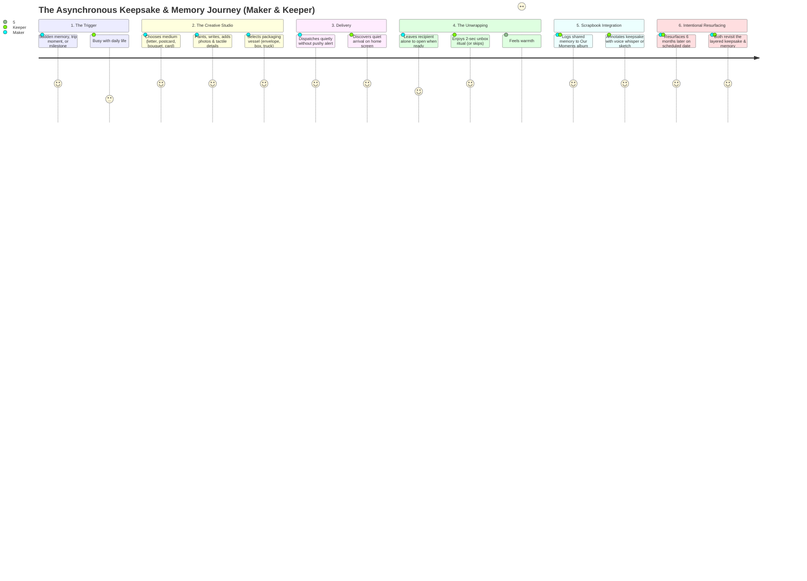

# UX Research & Empathy Modeling
*Phase 2: Relational Archetypes, Expressive Artifacts, Digital Scrapbooking & Asynchronous Journey*

---

## 1. The Relational Spectrum (Elastic Archetypes)
Because affection takes many shapes, the system avoids rigid romantic tropes. It supports three primary relational modes across an elastic spectrum:

```
[ KINSHIP & FAMILY ] ◄──────────► [ THE CONFIDANTS ] ◄──────────► [ CHOSEN PARTNERS ]
(Parent/Child, Siblings)       (Low-Frequency Friends)       (Romantic / Close Bonds)
Quiet comfort, irregular        Inside jokes, nostalgic       Tender apologies, milestones,
check-ins, practical care.      snapshots, shared humor.      unspoken spontaneous longing.
```

### Archetype Dynamics & Triggers

| Relational Mode | Example Pair | Primary Emotional Triggers | Anti-Pattern They Avoid | What "A Little Something" Gives Them |
| :--- | :--- | :--- | :--- | :--- |
| **Kinship & Family** | College student & Parent; Siblings in different cities | Sudden homesickness, post-call reflection, ordinary everyday moments. | Generic WhatsApp "Good morning" forwards or dry logistical calls. | A tangible sense that *"they took time out of their busy day to make this for me."* |
| **The Confidants** | Childhood or university friends living in different cities | An old memory resurfacing, an inside joke, post-travel reconnection. | Instagram reels sent with no context, lost in cluttered DMs. | A dedicated, permanent keepsake box free from social media noise. |
| **Chosen Partners** | Romantic partners (colocated or long-distance) | After an argument (reconciliation), quiet midnight longing, anniversaries. | Cold text arguments, read-receipt pressure, blue-tick anxiety. | A quiet space to offer an olive branch or leave a tender note to be unwrapped slowly. |

---

## 2. The Maker's Expressive Palette: What to Send
The heart of the app is the **Creative Atelier**—giving the sender distinct, tactile mediums to articulate emotion beyond generic text messages.

| Artifact Medium | Metaphor & Materiality | Emotional Nuance & Use Case | Craft Elements & Anatomy |
| :--- | :--- | :--- | :--- |
| **Handwritten Letter** | Textured stationery, fountain pen ink, wax seal | Deep intimacy, quiet apologies, unhurried reflections, vulnerability | Paper texture choices, margins, custom handwriting font/stroke, folded layout |
| **Digital Postcard** | Heavy cardstock, stamped corner, front/back flip | Everyday dispatches, travel moments, quick "thinking of you" notes | Front: Curated photo/illustration; Back: Short message, stamp, postal mark |
| **Greeting Card** | Bi-fold linen card, tactile paper crease | Celebrations, birthdays, holidays, congratulations | Cover illustration, interior spread with handwritten message, optional photo tuck-in |
| **Virtual Botanical Bouquet** | Hand-tied florist paper, botanicals & stems | Wordless comfort, cheer, symbolic gestures, gratitude | Curated flower selection, floral symbolism, ribbon tie, mini card tag on stems |
| **Custom Keepsake / Collage** | Mixed-media scrapbook page | Inside jokes, milestone celebrations, trip recaps | Layered ephemera, photo cutouts, washi tape, ticket stubs, scribbles |

---

## 3. The Relationship Ledger & Digital Scrapbooking
Beyond gifting in isolated moments, the app functions as a **living, tactile archive** of the relationship. It allows users to continuously log and preserve the texture of their shared life.

```
┌────────────────────────────────────────────────────────────────────────┐
│                      THE LIVING SCRAPBOOK ARCHIVE                      │
├────────────────────┬────────────────────┬──────────────────────────────┤
│  EVERYDAY MOMENTS  │     MILESTONES     │      JOURNEYS & TRIPS        │
│  "Coffee on rainy  │  First apartment,  │  Ticket stubs, travel snaps, │
│   Tuesday", inside │  anniversary, new  │  co-curated audio & location │
│   jokes, voicenotes│  job celebration   │  postcards                   │
└────────────────────┴────────────────────┴──────────────────────────────┘
                         │                                 │
                         ▼                                 ▼
             [ Linked to Studio Gifts ]       [ Scheduled Time Return ]
```

### Digital Scrapbooking Pillars:
1. **Unscripted Life Logging:** Capture both the small ordinary days (an unprompted voice whisper, a snapshot of morning coffee) and major milestones without the performance pressure of public social media.
2. **Dual-Perspective Memory Entries:** A memory entry can hold both people's recollections—his memory of a concert, her snapshot of the ticket stub, side-by-side.
3. **Tactile Scrapbook Aesthetics:** Digital elements mirror real-world scrapbooking—washi tape, paper clips, pressed leaves, polaroid frames, and handwritten captions.
4. **Living Memory Albums:** Custom-organized chapters (e.g., *"Our First Year in Hyderabad"*, *"Sunday Morning Walks"*, *"Late Night Conversations"*).

---

## 4. The Delivery Vessel System (Packaging Metaphor)
The sender does not simply "hit send." They choose how the gesture arrives, anchoring the aesthetic in physical craft and playful whimsy:

| Vessel Type | Visual Metaphor | Best Suited For | Unwrapping Interaction |
| :--- | :--- | :--- | :--- |
| **The Folded Parchment** | Letter with wax seal or paper ribbon | Quiet apologies, heartfelt notes, letters | Slide seal / unfold flaps |
| **The Tied Box** | Linen-textured box with grosgrain ribbon | Bouquets, multiple photos, cards | Untie ribbon / lift lid |
| **The Whimsical Truck** | Miniature vintage delivery truck | Playful jokes, postcards, spontaneous cheer | Tap truck door / open cargo bed |
| **The Archival Folder** | Manila envelope with string-and-button closure | Memory dumps, trip souvenirs, collages | Unwind twine around button |

---

## 5. Empathy Map: The Emotional Delta
Comparing the emotional state of communication in everyday apps vs. *A Little Something*.

```
                ┌──────────────────────────────────────────────┐
                │                  THINKING                    │
                │ Everyday: "I have to reply before they see   │
                │           the blue tick."                    │
                │ Atelier:  "I'll craft something thoughtful,  │
                │           and they'll open it in peace."     │
┌───────────────┴──────────────────────────────────────────────┴───────────────┐
│                    SEEING                    │                   HEARING                    │
│ Everyday: Endless notifications, read        │ Everyday: Ping sounds, typing alerts, urgent │
│           receipts, fleeting 24h stories.    │           calls.                             │
│ Atelier:  A curated craft atelier & warm     │ Atelier:  Silence. Gentle asynchronous       │
│           shelves of kept memories.          │           rhythms.                           │
├──────────────────────────────────────────────┼──────────────────────────────────────────────┤
│                   FEELING                    │                  SAYING & DOING              │
│ Everyday: Guilt of delayed response;         │ Everyday: Rushed emojis, reaction taps,      │
│           transactional exhaustion.          │           lost photos.                       │
│ Atelier:  Warmth of creating & receiving;    │ Atelier:  Pasting ticket stubs, writing in   │
│           pride of a shared history.         │           margins, keeping for years.        │
└─────────────────────────────────────────────────────────────────────────────┘
```

---

## 6. Dual-Actor Asynchronous Journey Map



### Detailed Journey Matrix

| Phase | Maker (Sender) | Keeper (Recipient) | Emotional State & UX Intent |
| :--- | :--- | :--- | :--- |
| **1. Spark** | Remembers a moment, returns from a trip, or celebrates a milestone. | Going about their day. | No pressure to create on a schedule; sparks are organic. |
| **2. Craft** | Enters Studio: selects format (letter, bouquet, postcard, scrapbook card), creates personal artwork, chooses delivery vessel. | Unaware. | Expressive, tactile canvas. Focus on personal crafting, not generic templates. |
| **3. Dispatch** | Sends gift. Chooses whether to store in My Vault or add directly to Shared Scrapbook. | Receives a subtle, non-urgent indicator. | Zero read receipts. Sender is free from anxiety about when it is opened. |
| **4. Reveal** | Completely detached from monitoring status. | Opens app when relaxed; unwraps the custom vessel (unfolding/unboxing). | Emotional delight: *"They took time out of their day to make this."* |
| **5. Scrapbook & Annotate** | Receives a gentle note whenever the keeper adds their layer or memory. | Circles a detail, links a memory of the day, leaves voice note, saves to album. | Collaborative layering without altering original artwork. |
| **6. Revisit** | Re-discovers the gift 6 months or 1 year later. | Re-discovers the memory alongside the maker. | Nostalgic closure: memories gain patina rather than disappearing. |
