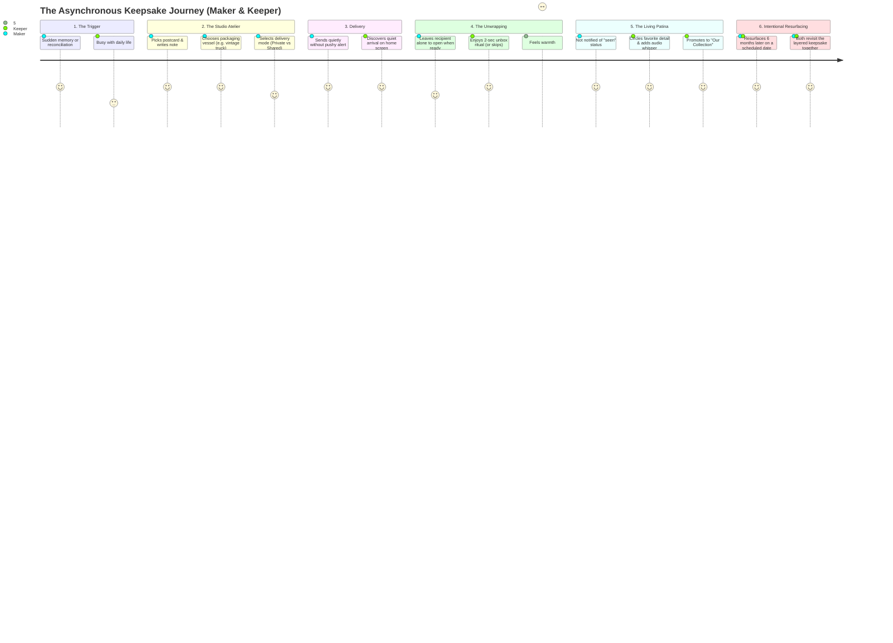

# UX Research & Empathy Modeling
*Phase 2: Relational Archetypes, Empathy Continuum & Dual-Actor Asynchronous Journey*

---

## 1. The Relational Spectrum (Elastic Archetypes)
Because affection takes many shapes, the system avoids rigid romantic tropes. It supports three primary relational modes across an elastic spectrum:

```
[ KINSHIP & FAMILY ] ◄──────────► [ THE CONFIDANTS ] ◄──────────► [ CHOSEN PARTNERS ]
(Parent/Child, Siblings)       (Low-Frequency Friends)       (Romantic / Close Bonds)
Quiet comfort, irregular        Inside jokes, nostalgic       Tender apologies, milestones,
check-ins, practical care.      snapshots, shared humor.      unspoken spontaneous longing.
```

### Archetype Dynamics & Triggers

| Relational Mode | Example Pair | Primary Emotional Triggers | Anti-Pattern They Avoid | What "A Little Something" Gives Them |
| :--- | :--- | :--- | :--- | :--- |
| **Kinship & Family** | College student & Parent; Siblings in different cities | Sudden homesickness, post-call reflection, ordinary everyday moments. | Generic WhatsApp "Good morning" forwards or dry logistical calls. | A tangible sense that *"they took time out of their busy day to make this for me."* |
| **The Confidants** | Childhood or university friends living in different cities | An old memory resurfacing, an inside joke, post-travel reconnection. | Instagram reels sent with no context, lost in cluttered DMs. | A dedicated, permanent keepsake box free from social media noise. |
| **Chosen Partners** | Romantic partners (colocated or long-distance) | After an argument (reconciliation), quiet midnight longing, anniversaries. | Cold text arguments, read-receipt pressure, blue-tick anxiety. | A quiet space to offer an olive branch or leave a tender note to be unwrapped slowly. |

---

## 2. Empathy Map: The Emotional Delta
Comparing the emotional state of communication in everyday apps vs. *A Little Something*.

```
                ┌──────────────────────────────────────────────┐
                │                  THINKING                    │
                │ Everyday: "I have to reply before they see   │
                │           the blue tick."                    │
                │ Atelier:  "I'll open this when I have a      │
                │           quiet cup of tea."                 │
┌───────────────┴──────────────────────────────────────────────┴───────────────┐
│                    SEEING                    │                   HEARING                    │
│ Everyday: Endless notifications, read        │ Everyday: Ping sounds, typing alerts, urgent │
│           receipts, fleeting 24h stories.    │           calls.                             │
│ Atelier:  A customized parcel waiting        │ Atelier:  Silence. Gentle asynchronous       │
│           quietly on a clean shelf.          │           rhythms.                           │
├──────────────────────────────────────────────┼──────────────────────────────────────────────┤
│                   FEELING                    │                  SAYING & DOING              │
│ Everyday: Guilt of delayed response;         │ Everyday: Rushed emojis, reaction taps,      │
│           transactional exhaustion.          │           lost photos.                       │
│ Atelier:  Gratitude; the tangible warmth     │ Atelier:  Circling a detail, writing in      │
│           of someone making an effort.       │           margins, keeping for years.        │
└─────────────────────────────────────────────────────────────────────────────┘
```

---

## 3. The Delivery Vessel System (Packaging Metaphor)
The sender does not simply "hit send." They choose how the gesture arrives, anchoring the aesthetic in physical craft and playful whimsy:

| Vessel Type | Visual Metaphor | Best Suited For | Unwrapping Interaction |
| :--- | :--- | :--- | :--- |
| **The Folded Parchment** | Letter with wax seal or paper ribbon | Quiet apologies, heartfelt notes, letters | Slide seal / unfold flaps |
| **The Tied Box** | Linen-textured box with grosgrain ribbon | Bouquets, multiple photos, cards | Untie ribbon / lift lid |
| **The Whimsical Truck** | Miniature vintage delivery truck | Playful jokes, postcards, spontaneous cheer | Tap truck door / open cargo bed |
| **The Archival Folder** | Manila envelope with string-and-button closure | Memory dumps, trip souvenirs, collages | Unwind twine around button |

---

## 4. Dual-Actor Asynchronous Journey Map



### Detailed Journey Matrix

| Phase | Maker (Sender) | Keeper (Recipient) | Emotional State & UX Intent |
| :--- | :--- | :--- | :--- |
| **1. Spark** | Remembers a moment, feels an urge to apologize, or sees a funny reference. | Going about their day. | No pressure to create on a schedule; sparks are organic. |
| **2. Craft** | Enters Studio: drafts note, arranges photo, picks delivery vessel (e.g., retro delivery truck). | Unaware. | Expressive, tactile canvas. Focus on crafting, not template picking. |
| **3. Dispatch** | Sends gift. Chooses whether to keep a personal copy in My Vault. | Receives a subtle, non-urgent indicator. | Zero read receipts. Sender is free from anxiety about when it is opened. |
| **4. Reveal** | Completely detached from monitoring status. | Opens app when relaxed; interacts with the vessel (unfolding/unboxing). | Emotional delight: *"They took time out of their day to make this."* |
| **5. Add to It** | Receives a gentle note whenever the keeper adds their layer. | Circles a detail with a digital crayon, leaves a voice note, or moves it to "Our Cabinet". | Recipient contributes without destroying the original artifact. |
| **6. Revisit** | Re-discovers the gift 6 months or 1 year later. | Re-discovers the gift alongside the maker. | Nostalgic closure: memories gain patina rather than disappearing. |
