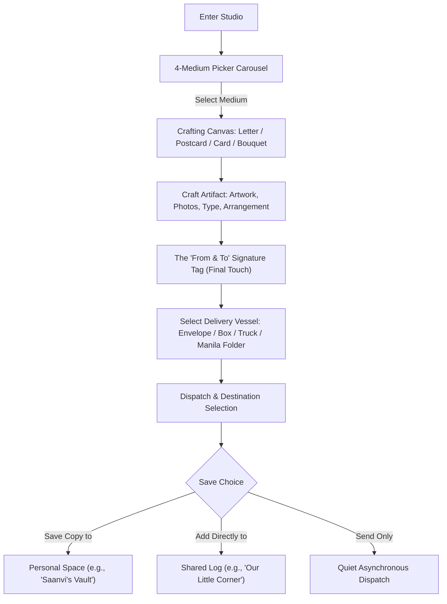
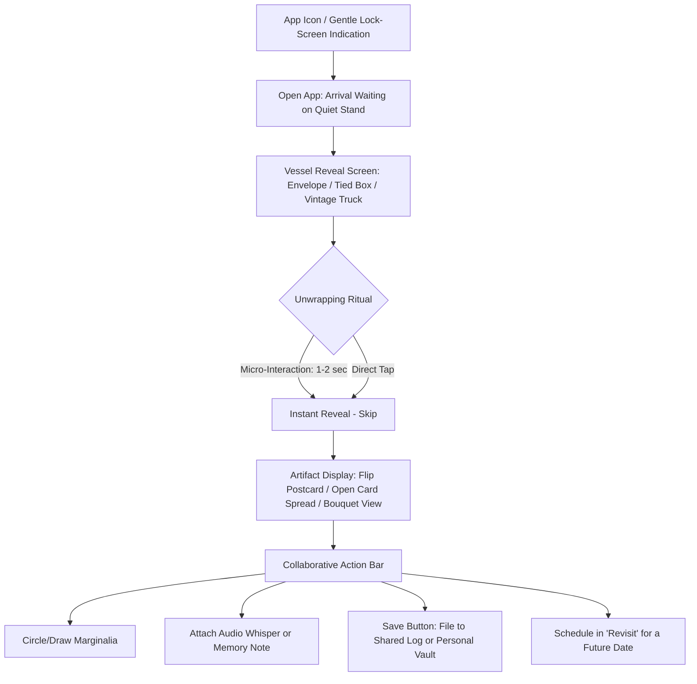
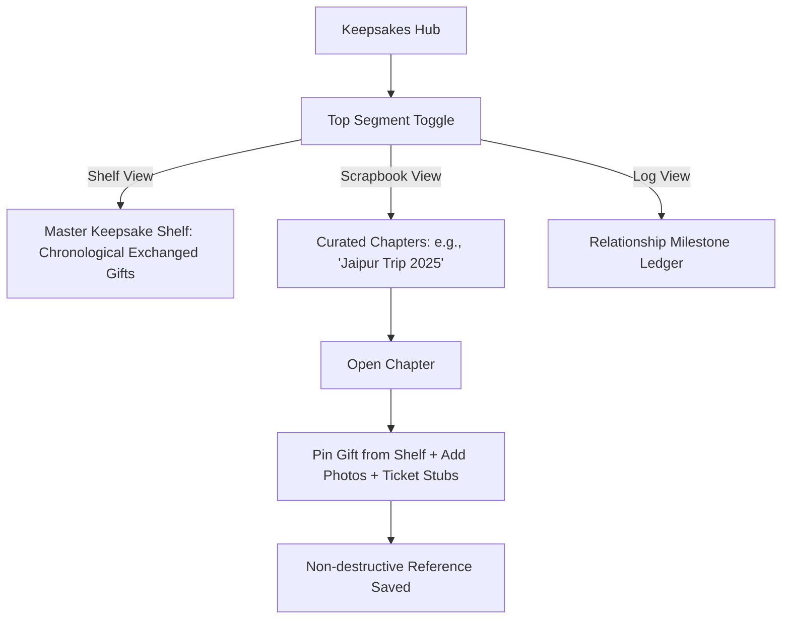

# User Flows & Low-Fidelity Wireframes (`WIREFRAMES.md`)
*Phase 4: Choreographed Task Flows, Screen Schematics, and Spatial Architecture*

---

## 1. Choreographed Task Flows

### Flow A: The Maker’s Creation & Packaging Flow


---

### Flow B: The Recipient’s Unwrapping & Collaborative Patina Flow


---

### Flow C: The Keepsake & Scrapbook Curation Flow


---

## 2. Low-Fidelity Screen Schematics (ASCII Wireframes)

### Screen 1: App Shell & Global Navigation (Mobile 390x844)
```
┌─────────────────────────────────────────┐
│ 09:41                             5G 🪫 │
├─────────────────────────────────────────┤
│                                         │
│                                         │
│            [ ACTIVE ROOM ]              │
│                                         │
│                                         │
├─────────────────────────────────────────┤
│    [✏️ Studio]   [🎁 Keepsakes]          │
│    [🔒 My Vault] [🕰️ Revisit]            │
└─────────────────────────────────────────┘
```

---

### Screen 2: The Studio — 4-Medium Atelier Picker
```
┌─────────────────────────────────────────┐
│ 09:41                                   │
│                                         │
│ THE STUDIO                              │
│ What would you like to make today?      │
│                                         │
│ ┌───────────────────┐ ┌───────────────┐ │
│ │  ✉️ LETTER         │ │ 🪪 POSTCARD   │ │
│ │  Quiet handwriting│ │ Two-sided flip│ │
│ └───────────────────┘ └───────────────┘ │
│                                         │
│ ┌───────────────────┐ ┌───────────────┐ │
│ │  💌 GREETING CARD │ │ 💐 BOUQUET    │ │
│ │  Folded bi-fold   │ │ Stem-by-stem  │ │
│ └───────────────────┘ └───────────────┘ │
│                                         │
│ [ Recently Saved Drafts (2) ────────► ] │
└─────────────────────────────────────────┘
```

---

### Screen 3: Studio Crafting Canvas & The "From/To" Packaging Step
```
┌─────────────────────────────────────────┐
│ ◄ Back               Postcard Canvas  Next ►│
├─────────────────────────────────────────┤
│ ┌─────────────────────────────────────┐ │
│ │                                     │ │
│ │     [ FRONT: Photo / Artwork ]      │ │
│ │                                     │ │
│ └─────────────────────────────────────┘ │
│   [ 🔄 Flip to Back for Message & Stamp ]│
│                                         │
│ ─────────────────────────────────────── │
│ FINAL TOUCH: ATTACH DEDICATION          │
│ From: [ Saanvi__________ ]              │
│ To:   [ Kabir___________ ]              │
│                                         │
│ CHOOSE PACKAGING VESSEL:                │
│ (•) Parchment Envelope  ( ) Tied Box    │
│ ( ) Vintage Toy Truck   ( ) Manila File │
│                                         │
│ SAVE TO:                                │
│ [☑] Personal Space: "Saanvi's Vault"    │
│ [ ] Shared Log:     "Our Little Corner" │
│                                         │
│ [         DISPATCH GENTLY 🕊️         ]  │
└─────────────────────────────────────────┘
```

---

### Screen 4: Recipient Unwrapping & Collaborative Patina
```
┌─────────────────────────────────────────┐
│ 09:41                              ✕    │
│                                         │
│ A little something for you...           │
│                                         │
│          ┌───────────────────┐          │
│          │   [TOY TRUCK]     │          │
│          │  Tap door to open │          │
│          └───────────────────┘          │
│             From: Saanvi                │
│                                         │
│       [  Tap to Unfold / Skip  ]        │
├─────────────────────────────────────────┤
│ [AFTER UNWRAPPING REVEAL]               │
│                                         │
│  ┌───────────────────────────────────┐  │
│  │   "Thinking of you this morning..."│ │
│  │   [Postcard Front / Back Flip]    │  │
│  └───────────────────────────────────┘  │
│                                         │
│ COLLABORATIVE ACTIONS:                  │
│ [ ✏️ Circle a Detail ] [ 🎙️ Voice Note ] │
│ [ 📌 Save to Keepsakes ] [ 🕰️ Revisit Later ]│
└─────────────────────────────────────────┘
```

---

### Screen 5: The Keepsakes Hub (Uncluttered Segmented View)
```
┌─────────────────────────────────────────┐
│ 09:41                           [⚙️ Edit]│
│                                         │
│ OUR LITTLE CORNER                       │
│ 2 Years, 4 Months Together              │
│                                         │
│ ┌─────────────────────────────────────┐ │
│ │ [ Keepsakes ] | [Scrapbooks] | [Log]│ │  ◄ Top Segmented Toggle
│ └─────────────────────────────────────┘ │
│                                         │
│ KEEPSAKE SHELF (Master Exchanged Gifts) │
│                                         │
│ ┌───────────────┐   ┌─────────────────┐ │
│ │ 💐 Ranunculus │   │ 🪪 Jaipur Post- │ │
│ │   Bouquet     │   │    card         │ │
│ │ From Kabir    │   │ From Saanvi     │ │
│ │ Oct 2, 2026   │   │ Sep 14, 2026    │ │
│ └───────────────┘   └─────────────────┘ │
│                                         │
│ ┌───────────────┐   ┌─────────────────┐ │
│ │ ✉️ Rain Note  │   │ 💌 Birthday Card│ │
│ │ From Kabir    │   │ From Saanvi     │ │
│ └───────────────┘   └─────────────────┘ │
│                                         │
│ [+ Add to Custom Scrapbook Chapter]     │
└─────────────────────────────────────────┘
```

---

### Screen 6: The Revisit Room (Scheduled Return Points)
```
┌─────────────────────────────────────────┐
│ 09:41                          [+ Drop] │
│                                         │
│ REVISIT                                 │
│ Moments returning across time           │
│                                         │
│ ┌─────────────────────────────────────┐ │
│ │ UPCOMING RETURN POINT               │ │
│ │ 📅 November 14, 2026 (In 39 days)   │ │
│ │ 🎁 A surprise locked by Kabir       │ │
│ │ "Open when autumn arrives"          │ │
│ └─────────────────────────────────────┘ │
│                                         │
│ PAST ECHOES (Resurfaced Keepsakes)     │
│ ┌─────────────────────────────────────┐ │
│ │ 💌 First Anniversary Note           │ │
│ │ Resurfaced on: Sep 20, 2026         │ │
│ │ [View Original] [Read Conversation] │ │
│ └─────────────────────────────────────┘ │
└─────────────────────────────────────────┘
```
